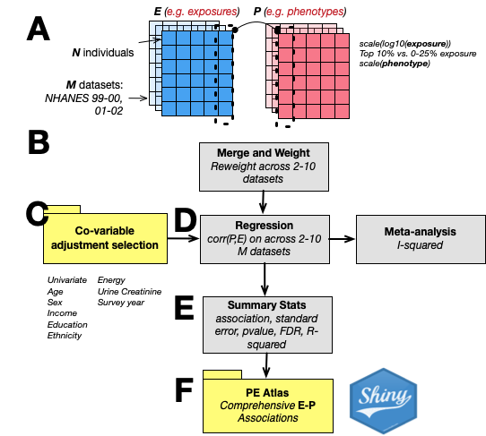

# Benchmarking exposome research: An atlas of exposome-phenome associations

06/02/25

## Summary

We build a comprehensive "atlas" of correlations between 305 phenotypes (e.g., methylation age, body mass index, glucose, height, creatinine) and 619 exposures and behaviors (e.g., self-reported nutrient intake; blood lead levels; urinary phthalates; blood PFOA) across the National Health and Nutrition Examination Surveys (NHANES), estimating \>100k associations in individuals from 1999-2017. For each survey, we associate the phenotype and exposure, and summarize the association size across the surveys. We assess the robustness of associations by estimating the false discovery rate, consistency with adjustments, and concordance across multiple waves of the surveys.

Specifically, the atlas provides a comprehensive list of exposure-phenome associations across the cohort, document statistical approaches used to associate exposures with phenotype, and systematically assesses reproducibility across independent cohorts.



## Phenome-Exposome Atlas and Browser

-   [PE Atlas](https://pe.exposomeatlas.com)

## nhanespewas: run your own P-E Associations

### Download the database

-   NHANES (.sqlite) <https://figshare.com/ndownloader/files/54925445>

-   Summary Statistics <https://figshare.com/ndownloader/files/58835380>

### Install the R package

```         
library(devtools)
devtools::install_github('chiragjp/nhanespewas')
```

### Execute an E-P Association

```         
# load the package
library(nhanespewas)
# connect to nhanes data, built for PE analysis
pedata_con <- connect_pewas_data(PATH_TO_THE_DATABASE)

# conduct an association between c-reactive protein and cotinine
## -   See pe_quickstart.Rmd

crp_cot <- pe_flex_adjust("LBXCRP", "LBXCOT", con=pedata_con, adjustment_variables = adjustment_models, scale_p=T)
# clean up
disconnect_pewas_data(pedata_con)
```

### Tutorials

-   [pe_quickstart.Rmd](https://github.com/chiragjp/nhanespewas/blob/main/pe_quickstart.Rmd): a quick tour on querying the database and running an association
-   [pe_catalog.Rmd](https://github.com/chiragjp/nhanespewas/blob/main/pe_catalog.Rmd): a listing of the variables catalogged for associations
-   [exwas_tour.Rmd](https://github.com/chiragjp/nhanespewas/blob/main/exwas_tour.Rmd): a high-level overview of the pipeline to conduct ExWAS
